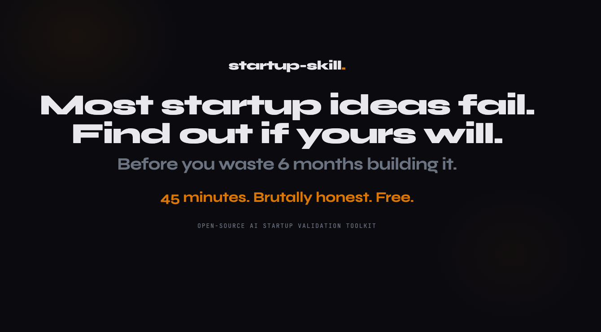

# Startup Skill

[](https://github.com/ferdinandobons/startup-skill/releases)
[](LICENSE)
[](https://github.com/ferdinandobons/startup-skill/stargazers)

<p align="center">
  
</p>

What a $10K strategy consultant would deliver: market research, competitive battle cards, positioning, financial projections, and a 30-day action plan. If your idea should die, it will tell you.

Works with [Claude Code](https://claude.ai/claude-code) and any agent that supports skills.

**Website:** [startupskill.me](https://startupskill.me)

**Contributions welcome!** [Open a PR](#contributing) or [an issue](https://github.com/ferdinandobons/startup-skill/issues).

## Available Skills

| Skill | What you get |
|-------|-------------|
| [startup-design](startup-design/) | Complete startup strategy: market research, competitive analysis, brand, product definition, financial projections, and validation experiments. 8 phases, 30+ structured deliverables. |
| [startup-competitors](startup-competitors/) | Battle cards for every competitor, pricing landscape, feature matrix, and strategic report. Built from real reviews, forums, and web data. |
| [startup-positioning](startup-positioning/) | Market positioning using April Dunford's framework. Positioning doc, competitive alternatives map, market category analysis, and messaging implications. |
| [startup-pitch](startup-pitch/) | Investor-ready pitch in multiple formats: 10-min, 5-min, 2-min, 1-min elevator, and email. Includes scoring rubric, Q&A prep, and investor roleplay practice. |

## Usage

Describe what you need — skills trigger automatically:

> *"I want to build a SaaS for real estate agents that automates follow-up emails. Is it worth building?"*

**→ `startup-design`** runs the full 8-phase process

---

> *"Who are my competitors in the project management space for creative agencies? I need battle cards and a pricing comparison."*

**→ `startup-competitors`** profiles 5-8+ competitors across 3 research waves

---

> *"Quick validation — fast track mode."*

**→ `startup-design`** runs a compressed go/no-go analysis

---

> *"How should we position our product? We're in the project management space but we're different from Asana and Monday."*

**→ `startup-positioning`** builds positioning through Dunford's 5+1 components

---

> *"Prepare my pitch — I'm raising 500K pre-seed. We have 45 active customers growing 20% MoM."*

**→ `startup-pitch`** builds pitch narratives in multiple formats with scoring and Q&A prep

Or invoke directly: `/startup:startup-design`, `/startup:startup-competitors`, `/startup:startup-positioning`, `/startup:startup-pitch`

> **Token usage:** These skills run multiple research agents and can consume a large number of tokens. For the best experience, use [Claude Max 5x](https://claude.ai/upgrade). If a session hits the limit, just ask Claude to "resume from where you left off" — it will pick up the process.

## Installation

### Claude Code Plugin (Recommended)

```bash
claude plugin marketplace add ferdinandobons/startup-skill
claude plugin install startup@startup-skill
```

<details>
<summary><strong>Claude.ai (Web App)</strong></summary>

Download `.skill` files from the [Releases page](https://github.com/ferdinandobons/startup-skill/releases), then upload in **Settings → Skills**.

</details>

<details>
<summary><strong>Other Methods</strong></summary>

```bash
# CLI Install
npx skills add ferdinandobons/startup-skill

# Clone and copy
git clone https://github.com/ferdinandobons/startup-skill.git
cp -r startup-skill/startup-design .agents/skills/
cp -r startup-skill/startup-competitors .agents/skills/
cp -r startup-skill/startup-positioning .agents/skills/
cp -r startup-skill/startup-pitch .agents/skills/

# Git submodule
git submodule add https://github.com/ferdinandobons/startup-skill.git .agents/startup-skill

# SkillKit (works with Claude Code, Cursor, Copilot, etc.)
npx skillkit install ferdinandobons/startup-skill
```

</details>

<details>
<summary><strong>Updating</strong></summary>

**Claude Code Plugin:**
```bash
claude plugin update startup@startup-skill
```

> If the update doesn't pick up new changes, refresh the marketplace source and reinstall:
> ```bash
> claude plugin uninstall startup@startup-skill
> claude plugin marketplace remove startup-skill
> claude plugin marketplace add ferdinandobons/startup-skill
> claude plugin install startup@startup-skill
> ```

**Claude.ai:** Download the latest `.skill` files from the [Releases page](https://github.com/ferdinandobons/startup-skill/releases) and re-upload in **Settings → Skills**.

**CLI / SkillKit:** Re-run the install command — it overwrites the previous version:
```bash
npx skills add ferdinandobons/startup-skill
# or
npx skillkit install ferdinandobons/startup-skill
```

**Git Submodule:**
```bash
git submodule update --remote .agents/startup-skill
```

</details>

## Contributing

See [CONTRIBUTING.md](CONTRIBUTING.md) for details.

## License

[MIT](LICENSE)
